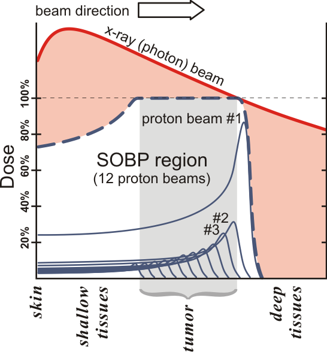

# Spread-Out-Bragg-Peak
Python script which numerically determines the proton beam energy distribution required to synthesize a spread-out Bragg peak (SOBP) with a uniform dose on a given depth interval from individual Bragg peaks. It is assumed that the protons' range-energy relationship follows a power law. The Numpy, Scipy, and Matplotlib packages are required to run the script.

## Introduction
The chief advantage of proton therapy over X-ray therapy is that doses can be administered at more precisely controlled depths beneath the skin, avoiding damage to healthy tissue surrounding the tumor. Unlike X-rays, the dose of which decays approximately exponentially with depth _d_ beneath the skin, protons' dose increases as they slow down, dropping rapidly to zero after they come to a standstill (Figure 1).

  
**Figure 1.** Comparison of depth-dose profiles for an X-ray beam (in red) and proton beam (in solid blue). Multiple proton beams are shown with different energies. The dashed blue line delineates a spread-out Bragg peak (SOBP) created by  superposition of 12 monoenergetic beams. It is designed such that 100% dose is reached in the tumor area (shaded gray). (Source: [Wikipedia](https://en.wikipedia.org/wiki/Proton_therapy)).

In radiotherapy applications, it is typically required to cover an extended tumor volume with a required dose. Such a 'spread-out Bragg peak' (SOBP) can be achieved by superposition of elementary Bragg peak depth-dose curves.

This script determines the weighting factors _W_(_R_) for the Bragg peaks of range _R_ such that the superposition results in a flat SOBP of height _D_0 within an interval \[_d_a,_d_b\]. The approach follows [Bortfeld & Schlegel (1996)](http://www.ncbi.nlm.nih.gov/pubmed/8858723), who obtained an analytical solution. The numerical solution can be more easily extended, however, to experimentally determined Bragg peaks which do not exactly fit the power law range-energy relationship assumed.

## Results
The script generates three plots:
1. a Bragg peak,
2. a weighting function,
3. the resultant SOBP.
Each is presented in turn below.

### Bragg peak
Following [Bortfeld & Schlegel (1996)](http://www.ncbi.nlm.nih.gov/pubmed/8858723), it is assumed that the relationship between the initial energy _E_(_d_ = 0) = _E_0 and the range _d_ = _R_ in the medium is approximately given by

,  
where  and _p_ are empirical constants. With _p_ = 1.5, this relationship is known as Geiger's rule.

The beam deposits energy along its path between _d_ = 0 and _d_ = _R_ in the medium. The remaining energy _E_(_d_) at an arbitrary depth must just suffice to travel the distance _R_ - _d_. Thus, according to the range-energy relationship, _R_ - _d_ =  _E__p_(_d_), or

.  
The depth-dose distribution of a monoenergetic broad beam, _D__BP_(_d_), can then be approximated as

,  
where  is the density of the medium. _D__BP_ has the units of dose per unit incident particle fluence (Gy cm2). A plot of this impulse response function for _p_ = 1.5 is shown in Figure 2.  
  
**Figure 2.** Normalized depth-dose distribution for a monoenergetic proton beam ('Bragg peak') with maximum range _R_ = 15 cm and _p_ = 1.5. The exact solution _D__BP_(_d_) is represented by the cyan curve, and has a singularity at _d_ = _R_. This was handled in the discretized impulse response, shown by the blue dots, by taking the (numerically computed) average of the exact impulse response on intervals \[_x_\[_n_\] - _dx/2_, _x_\[_n_\] + _dx/2_\], where _x_\[_n_\] represents a grid point and _dx_ the grid spacing, rather than sampling the Bragg peak directly.

### Weighting function
The calculation of the weighting function is similar to that outlined in Appendix A of [Bortfeld & Schlegel (1996)](http://www.ncbi.nlm.nih.gov/pubmed/8858723); however, rather than deriving an analytical solution by using the Laplace transform, a numerical approximation is generated using Scipy's "deconvolve" function. The resulting _W_(_R_) designed to achieve a SOBP which is flat between _d__a_ = 10 cm and _d__b_ = 15 cm is shown in Figure 3.  
  
**Figure 3.** Weighting function _W_(_R_) for proton beams with range _R_ required to achieve a uniform dose distribution _D_0 in the interval \[10, 15\] cm for _p_ = 1.5. The cyan curve shows the exact solution from Equation (4) of [Bortfeld & Schlegel (1996)](http://www.ncbi.nlm.nih.gov/pubmed/8858723), and the blue dots show the numerical approximation obtained by deconvolution.

### Spread-out Bragg peak
The SOBP resulting from convolving the individual Bragg peak with the weighting function is shown in Figure 4.  
  
**Figure 4.** A comparison of an analytical Bragg curve (in cyan; from [Bortfeld & Schlegel (1996)](http://www.ncbi.nlm.nih.gov/pubmed/8858723), Equation (6)) with a discretized one (in blue dots). The plot is normalized to the desired dose _D_0 in the interval \[_d__a_, _d__b_\] = \[10, 15\] cm.

As seen from Figure 4, the numerical solution deviates slightly from the exact one; this effect is also seen in Figure 2 of [Bortfeld & Schlegel (1996)](http://www.ncbi.nlm.nih.gov/pubmed/8858723). The agreement improves as the number of Bragg peaks increases, as the reader can verify by varying the parameter _N_ in the script.

## Conclusion and discussion
The weighting of proton beam energies required to achieve a spread-out Bragg peak (SOBP) with uniform dose in a specified depth interval was calculated numerically and found to agree well with an analytical solution.

Further work could include adapting the script so that it can directly use tables of measured Bragg peaks, rather than parameterizing them by assuming that the range-energy relationship follows a power law.
